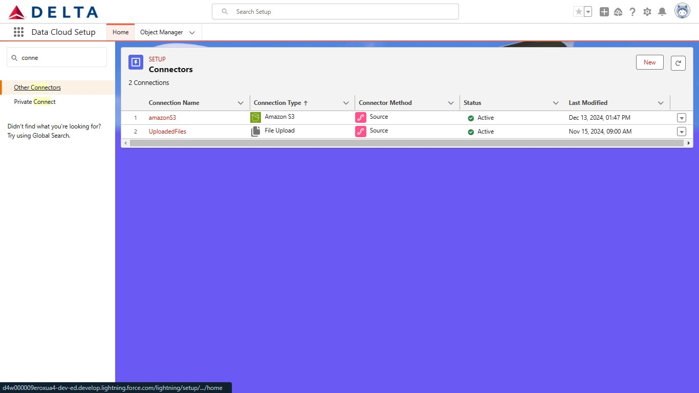

# Salesforce-DataCloud-Implementation
## Clicked Admin Sprint- DataCloud Implementation for Delta Airlines.

<b>Disclaimer</b>

*This implementation is not affiliated with or endorsed by Delta Airlines or any other airline. The data used in this project was randomly generated and is intended for educational and learning purposes only. Any references to Delta Airlines or its logo are purely for illustrative purposes to provide context to the learning scenario. The inclusion of the Delta Airlines logo does not imply sponsorship, partnership, or support from Delta Airlines.*

  
📖 Table of Contents

  - [Introduction](https://github.com/Oyinfunke/Salesforce-DataCloud-Implementation?tab=readme-ov-file#introduction)
  - [Business Use Case](https://github.com/Oyinfunke/Salesforce-DataCloud-Implementation?tab=readme-ov-file#business-use-case)
  - [Solution Design](https://github.com/Oyinfunke/Salesforce-DataCloud-Implementation?tab=readme-ov-file#solution-design)
  - [Implementation](https://github.com/Oyinfunke/Salesforce-DataCloud-Implementation?tab=readme-ov-file#implementation)
  - [Lessons Learned](https://github.com/Oyinfunke/Salesforce-DataCloud-Implementation?tab=readme-ov-file#lessons-learned)
  - [Connect With Me](https://github.com/Oyinfunke/Salesforce-DataCloud-Implementation?tab=readme-ov-file#connect-with-me)

### Introduction
#### Objective
To unify Delta Airlines’ siloed customer data into Salesforce Data Cloud, creating a single source of truth for each customer.

#### Key Features
- Data Streaming
- Data Mapping
- Profile Unification

### Business Use case
    
#### Problem Statement

 Delta Airlines faces challenges in staying competitive due to data silos and a lack of actionable insights. The company’s data is scattered across siloed systems making it difficult to gain a unified view of customer profiles. This fragmentation leads to inefficiencies in resolving customer issues, a lack of actionable business insights, and an inability to devise data-driven strategies.
    
#### Users Story
    
 **1.  Data Administrator**
        
 As a **Data Administrator**, **I need to** integrate customer data from multiple sources like Amazon S3, other Salesforce orgs and local files into Salesforce Data Cloud **so that I can** manage all data from a single platform (Data Cloud)
        
 **Acceptance Criteria**
    
- Data streaming from all sources is automated and validated for accuracy.
- Source data is appropriately mapped to Data Model Objects (DMO)
- A unified profile of each customer is created

**2.  Customer Service Agent**

As a **Customer Service Agent**, **I need** a 360-degree view of customer profiles **so that I can** resolve customer inquiries quickly and provide personalized support.
        
**Acceptance Criteria**

- Access to a 360-degree view of customer profile
- Service requests resolution with a 20% reduction in handling time.

### Solution Design
  
  
 

      <b>Delta Airline Data Cloud Architecture Diagram</b>
  

      

    <b>Data Flow in Data Cloud</b>
  

### Implementation
    
#### Configuration
    
<b>Data Stream and Ingestion</b>
**Connecting the external Salesforce org and setting other connectors (Amazon S3 and UploadFile)**
            
1. Connecting my Salesforce CRM to SF Data Cloud org
                

  

2. Connecting the Amazon S3 storage to SF Data Cloud org
            

  

**Setting the data stream**
          

  
 

**Data Ingestion into Data Cloud**

      
    

    
**Data Mapping**

**Profile Unification**

      
    

    
 ### Lessons Learned
    
**Challenges Faced**

- Creating and ingesting my data from a local file source was fraught with error and inefficiencies, so I resorted to using Amazon S3 and Salesforce CRM as my data sources.
- Mapping the Profile category data correctly to the appropriate DMOs in order to create identity resolution. Eventually I mapped the Profile category data to the Individual, Contact Point Email, Party Identification and Party DMOs

### Tools and Technologies used
- Salesforce Data Cloud
- Salesforce CRM
- Amazon S3

### 🔴Connect with Me

**Linkedin:** [www.linkedin.com/in/oyinfunke](http://www.linkedin.com/in/oyinfunke)

**Calendly:** [Take a Virtual Coffee with me](https://calendly.com/oyinfunke7/quick-chat)

**Email:** [oyinfunke7@gmail.com](mailto:oyinfunke7@gmail.com)
    

